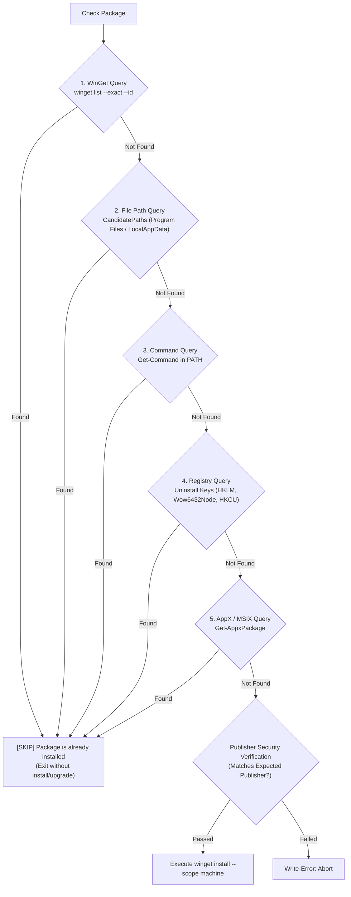

# 2026-09-20-009

## Summary

### Summary of Changes & Verification

The workstation provisioning script
[ `windows/setup/Setup-Workstation.ps1`](file:///C:/usr/src/df/powershell/df-powershell/windows/setup/Setup-Workstation.ps1)
has been updated to guarantee **strict idempotency** on re-runs and to include
**Visual Studio 2022 Community** with publisher verification.

---

### 1. Strict Idempotency Query (No Reinstallation or Re-runs)

Rather than running `winget install` or attempting auto-upgrades when an
application is already present,
[ `windows/setup/Setup-Workstation.ps1`](file:///C:/usr/src/df/powershell/df-powershell/windows/setup/Setup-Workstation.ps1)
now invokes a dedicated query cmdlet (`Test-IsApplicationInstalled`) before any
installation or elevation step:



#### Multi-Source Detection Capabilities:

1. **WinGet Catalog:** Queries `winget list --exact --id <id>`. If installed
   (even if a newer revision exists), it records the version and returns.
2. **Filesystem Candidate Paths:** Inspects `%ProgramFiles%`,
   `%ProgramFiles(x86)%`, and `%LOCALAPPDATA%` (e.g. catches standalone Google
   Chrome or Visual Studio installations).
3. **System PATH Commands:** Resolves binaries registered in PATH via
   `Get-Command` (`git.exe`, `nvim.exe`, `lsd.exe`, `wt.exe`, `pwsh.exe`).
4. **Windows Registry:** Searches 64-bit, 32-bit (`Wow6432Node`), and `HKCU`
   uninstall keys using strict-mode-safe property reflection (catches standalone
   installations like MSYS2).
5. **AppX / MSIX Store Database:** Resolves packaged applications like Windows
   Terminal via `Get-AppxPackage`.

---

### 2. Visual Studio 2022 Community Addition & Publisher Verification

`Microsoft.VisualStudio.2022.Community` has been added to the package catalog:

- **WinGet ID:** `Microsoft.VisualStudio.2022.Community`
- **Fallback Chocolatey ID:** `visualstudio2022community`
- **Expected Publisher:** `Microsoft Corporation`
- **Binary Command:** `devenv.exe`

#### WinGet Manifest Publisher Verification:

```text
Found Visual Studio Community 2022 [Microsoft.VisualStudio.2022.Community]
Version: 17.14.41
Publisher: Microsoft Corporation
Homepage: https://visualstudio.microsoft.com/
Installer Url: https://download.visualstudio.microsoft.com/download/pr/.../vs_Community.exe
License Url: https://visualstudio.microsoft.com/license-terms/
Copyright: Copyright (c) Microsoft Corporation. All rights reserved.
```

The script cross-checks the manifest publisher against `Microsoft Corporation`
prior to installation.

---

### 3. Verification Test Run

The updated script was validated on this workstation (`ZEUS`) using
`.\Setup-Workstation.ps1 -WhatIf -SkipUserCreation`. All 9 packages were queried
and skipped without any installation or upgrade attempts:

```text
============================================================
      Windows Workstation Setup & Provisioning Script
============================================================
Date        : 2026-09-20 18:36:01
Computer    : ZEUS
Current User: zeus\df
PowerShell  : 7.6.6
============================================================
=== Software Installation Phase ===
[INFO] Detected Windows Package Manager (winget): C:\Users\dimfw\AppData\Local\Microsoft\WindowsApps\winget.exe

>>> [1/9] Windows Terminal (Microsoft.WindowsTerminal)
[SKIP] Windows Terminal (v1.24.11911.0) is already installed [WinGet]. Skipping reinstallation.

>>> [2/9] PowerShell (Microsoft.PowerShell)
[SKIP] PowerShell (v7.6.6.0) is already installed [WinGet]. Skipping reinstallation.

>>> [3/9] Visual Studio Community 2022 (Microsoft.VisualStudio.2022.Community)
[SKIP] Visual Studio Community 2022 (v17.14.41) is already installed [WinGet]. Skipping reinstallation.

>>> [4/9] Google Chrome (Google.Chrome)
[SKIP] Google Chrome (v153.0.8010.48) is already installed [File (C:\Program Files\Google\Chrome\Application\chrome.exe)]. Skipping reinstallation.

>>> [5/9] Git (Git Bash) (Git.Git)
[SKIP] Git (Git Bash) (v2.54.0) is already installed [WinGet]. Skipping reinstallation.

>>> [6/9] MSYS2 (MSYS2.MSYS2)
[SKIP] MSYS2 (v20230718) is already installed [Registry (MSYS2)]. Skipping reinstallation.

>>> [7/9] Neovim (nvim) (Neovim.Neovim)
[SKIP] Neovim (nvim) (v0.9.1) is already installed [WinGet]. Skipping reinstallation.

>>> [8/9] LSD (LSDeluxe) (lsd-rs.lsd)
[SKIP] LSD (LSDeluxe) (v1.1.5) is already installed [WinGet]. Skipping reinstallation.

>>> [9/9] Microsoft PowerToys (Microsoft.PowerToys)
[SKIP] Microsoft PowerToys (v0.97.2) is already installed [WinGet]. Skipping reinstallation.

>>> Synchronizing System PATH for All Users
[INFO] All detected tool directories are already present in System PATH.
```

- **PSScriptAnalyzer Status:** Passed with `0` errors and `0` warnings against
  [ `.psscriptanalyzer.psd1`](file:///C:/usr/src/df/powershell/df-powershell/.psscriptanalyzer.psd1).
- **Documentation:** Updated and formatted in
  [ `windows/setup/README.md`](file:///C:/usr/src/df/powershell/df-powershell/windows/setup/README.md).
