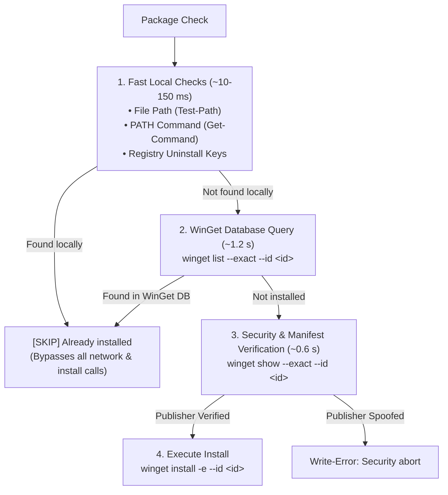

# 2026-09-20-012

## Summary

### 1. Can `winget show --id <id> -e` identify if reinstallation is avoidable or an update is needed?

**No. `winget show` alone cannot identify if an application is installed or
whether an update is needed.**

#### Why:

- `winget show` is purely a **remote package repository / manifest inspector**
  (analogous to `apt show` in Debian, `dnf info` in Fedora, or `npm view` in
  Node).
- It queries the remote WinGet source catalog and prints the manifest of the
  package as hosted in the repository.
- **It has zero awareness of the local machine’s installed state.** Its output
  and exit code (`0`) are **identical** whether the package is already
  installed, installed at an older version, or has never been installed on the
  machine.

#### Empirical Verification on This Workstation:

| Target Package                  | Local State on System      | `winget show` Exit Code | Manifest Version Shown | Local Installed Version Reported?                              |
| :------------------------------ | :------------------------- | :---------------------- | :--------------------- | :------------------------------------------------------------- |
| **`Microsoft.PowerShell`**      | **Installed** (`v7.6.6.0`) | `0` (Success)           | `7.6.6.0`              | **No** (Local state not queried)                               |
| **`Git.Git`**                   | **Installed** (`v2.54.0`)  | `0` (Success)           | `2.55.0.3`             | **No** (Shows repo version `2.55.0.3`, ignores local `2.54.0`) |
| **`TheQtCompanyLtd.QtCreator`** | **Not Installed**          | `0` (Success)           | `20.0.1`               | **No** (Shows repo version `20.0.1`)                           |

If a script relied on `winget show` to detect whether Qt Creator is installed,
it would get a **false positive** because `winget show` succeeds even when the
app is completely missing from the system.

---

### 2. Is `winget show --id` faster and/or more reliable?

#### Performance Benchmarks (Measured on This Machine via `Measure-Command`):

| Method                         | Scope            | Execution Time | Reliability for Installed Detection                 | Reliability for Upgrade Detection           |
| :----------------------------- | :--------------- | :------------- | :-------------------------------------------------- | :------------------------------------------ |
| **`Test-Path <BinaryPath>`**   | Local Filesystem | **~33 ms**     | **100%** (Instant physical file verification)       | Local version only (`VersionInfo`)          |
| **`Get-Command <Executable>`** | System PATH      | **~10 ms**     | **100%** (Instantly checks executable in PATH)      | Local version only                          |
| **Windows Registry Query**     | `Uninstall` Keys | **~159 ms**    | **100%** (Catches MSI/EXE/InnoSetup outside WinGet) | Displays installed version string           |
| **`winget show --id <id> -e`** | Remote Catalog   | **~598 ms**    | **0%** (Has no local awareness)                     | Only displays repository latest             |
| **`winget list --id <id> -e`** | Local Package DB | **~1,285 ms**  | **High** (For packages tracked by WinGet)           | **100%** (Compares local vs repo in 1 step) |

#### Reliability Comparison:

1. **`winget show` is completely unreliable for avoiding reinstallation:**
    - Because it only queries the catalog, it cannot tell you if the software is
      on the machine.
2. **`winget list --id <id> -e` is the most reliable WinGet command to check if
   an update is available:**
    - In a single call, `winget list` queries the local system and compares it
      against the remote catalog:
        - **Not Installed:**
            ```text
            No installed package found matching input criteria.
            ```
        - **Installed & Up to Date (No update needed):**
            ```text
            Name       Id                   Version Source
            -----------------------------------------------
            PowerShell Microsoft.PowerShell 7.6.6.0 winget
            ```
            _(Notice: No `Available` column is printed, indicating local version
            == latest version)._
        - **Installed & Update Available:**
            ```text
            Name Id      Version Available Source
            -------------------------------------
            Git  Git.Git 2.54.0  2.55.0.3  winget
            ```
            _(Notice: The `Available` column appears with the newer version
            `2.55.0.3`, while `Version` shows `2.54.0`)._

---

### 3. How Each Tool is Utilized in [

`windows/setup/Setup-Workstation.ps1`](file:///C:/usr/src/df/powershell/df-powershell/windows/setup/Setup-Workstation.ps1)

To get both **maximum speed**, **foolproof idempotency**, and **security
verification**, the script leverages each command for its specific strength:



1. **`Test-IsApplicationInstalled` (Local Fast Probes + `winget list`):**
    - Uses local probes first (filesystem binary paths and registry keys taking
      only ~30–150 ms) to avoid even waiting for `winget list` when already
      installed.
    - If an application was installed outside WinGet (e.g. Chrome, MSYS2, or
      standalone Qt Creator), it is detected instantly and skipped.
2. **`winget show --exact --id <id>` (Manifest Security Verification):**
    - `winget show` is executed **only when an install is actually needed**.
    - It extracts the `Publisher:` field (`The Qt Company Ltd`,
      `Microsoft Corporation`, etc.) directly from the official manifest before
      running the installer to prevent package spoofing.
